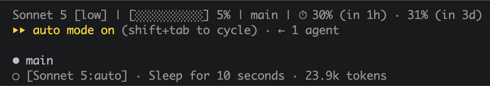

# agent-status-call

A Claude Code plugin providing a custom status line and subagent status line:
context-window usage, git/hg branch, Claude.ai rate-limit windows, and
per-subagent model/effort rows in the agent panel.



The top two lines are `status-line.sh`'s output — model/effort, context usage,
branch, and rate-limit countdown, plus Claude Code's own manual-mode/agent-count
line beneath it. The `[Sonnet 5:auto] · Sleep for 10 seconds · 23.4k tokens` row
below `main` is `subagent-status-line.sh`'s output — the subagent's resolved
model/effort prepended to the panel's existing name/description/token-count row.

## What it does

**`scripts/status-line.sh`** — renders the main status line:

```
Model [effort] | [██░░░░░░░░] 30% | branch | ⏱ 42% (in 3h) · 18% (in 2d)
```

- **Model** — the session's display name (or model ID), followed by the
  reasoning effort in brackets (`.effort.level`, or `auto` when that field is
  absent — e.g. the model doesn't support the effort parameter).
- **Context** — a 10-block usage bar with percentage.
- **Git/Hg branch** — read-only lookup against the session's working directory;
  omitted outside a repo or when there's no resolvable branch/bookmark.
- **Rate limits** — Claude.ai 5-hour and 7-day window usage with a countdown to
  reset. The 7-day window also flags pace overruns (a `!` after the percentage)
  against a daily budget, so you can see at a glance if you're burning the
  weekly allowance faster than a steady pace would allow.

**`scripts/subagent-status-line.sh`** — overrides each row in the agent panel
to add that subagent's own resolved model and effort in front of the
existing `name · description · token count` row, instead of just the main
session's model. Claude Code's default row for a running subagent looks like:

```
code-reviewer · Reviewing the diff for bugs · 12.4k tokens
```

With this plugin active, the same row becomes:

```
[Opus 5:high] · code-reviewer · Reviewing the diff for bugs · 12.4k tokens
```

— prepending the model/effort that subagent is actually running on, which
the main status line can't show you (it only ever sees the top-level
session's model). `name`, `description`, and the token count are each
omitted if the underlying field is absent, and `effort` defaults to `auto`
when the subagent inherits the session's effort level. Different subagents
in the panel get their own row:

```
[Haiku 4.5:auto] · quick-check · Checking imports · 850 tokens
[Opus 5:high] · code-reviewer · Reviewing the diff for bugs · 12.4k tokens
```

Both scripts require `jq`. `status-line.sh`'s rate-limit countdown works under
both BSD `date` (macOS) and GNU `date` (Linux): it detects which one is on
`PATH` via `date --version` (GNU supports the flag, BSD doesn't) and picks the
matching parser, so the rest of the script never checks which OS it's on. See
`scripts/status-line.sh`'s "Timestamp parsing" header comment for the exact
mechanism.

## Installation

This plugin is published from the [homers-drinking-bird](https://github.com/kierans/homers-drinking-bird)
marketplace. From inside a Claude Code session, run:

```
/plugin marketplace add kierans/homers-drinking-bird
/plugin install agent-status-call@homers-drinking-bird
```

If the install summary says `Run /reload-plugins to activate.`, run:

```
/reload-plugins
```

Verify it loaded with `/plugin list` or `claude plugin details agent-status-call@homers-drinking-bird`.

### Subagent status line and main status line

Wire both up yourself. A plugin's `settings.json` is schema-permitted to declare
`subagentStatusLine` (and `agent`), but as of Claude Code 2.1.221 the effective-settings
resolver that backs both `statusLine` and
`subagentStatusLine` only merges `userSettings`, `projectSettings`,
`localSettings`, `flagSettings`, and `policySettings` — plugin-contributed settings are
validated on install but never folded into that merge. So despite passing schema validation, a
plugin-declared `subagentStatusLine`
is silently never read, and the hook never runs. Confirmed by instrumenting the script to log
invocations and observing zero calls across a full subagent lifecycle. Until that's fixed
upstream, both status lines need manual wiring in your own `settings.json`.

`/plugin install` puts the scripts at:

```
~/.claude/plugins/cache/homers-drinking-bird/agent-status-call/<version>/scripts/status-line.sh
~/.claude/plugins/cache/homers-drinking-bird/agent-status-call/<version>/scripts/subagent-status-line.sh
```

`<version>` changes every time the plugin updates, so don't point either
setting straight at that path — point at symlinks instead, and re-point them
after each update:

```bash
ln -sf ~/.claude/plugins/cache/homers-drinking-bird/agent-status-call/1.0.0/scripts/status-line.sh \
  ~/.claude/scripts/status-line.sh
ln -sf ~/.claude/plugins/cache/homers-drinking-bird/agent-status-call/1.0.0/scripts/subagent-status-line.sh \
  ~/.claude/scripts/subagent-status-line.sh
```

```json
{
  "statusLine": {
    "type": "command",
    "command": "bash ~/.claude/scripts/status-line.sh"
  },
  "subagentStatusLine": {
    "type": "command",
    "command": "bash ~/.claude/scripts/subagent-status-line.sh"
  }
}
```

## Testing

Both scripts read a JSON payload from stdin. Test either one directly:

```bash
echo '{"model":{"display_name":"Opus"},"context_window":{"used_percentage":30},"effort":{"level":"high"}}' \
  | ./scripts/status-line.sh

echo '{"tasks":[{"id":"t1","model":"claude-opus-5","effort":"high","name":"code-reviewer","description":"Reviewing the diff for bugs","tokenCount":12400}]}' \
  | ./scripts/subagent-status-line.sh
```

### Testing the rate-limit countdown on both date flavors

`status-line.sh` picks `parse_timestamp_bsd` or `parse_timestamp_gnu` once at
startup based on `date --version`. Exercise the countdown with all three
accepted `resets_at` shapes — ISO with a `Z` suffix, ISO with a `+HH:MM`
offset, and a plain epoch:

Timestamps are computed relative to "now" so the countdown in the output
actually matches, rather than hardcoding a date that goes stale:

```bash
Z_TS=$(date -u -v+3H +"%Y-%m-%dT%H:%M:%SZ")           # macOS date; use
OFFSET_TS=$(date -u -v+2d +"%Y-%m-%dT%H:%M:%S+00:00")  # `date -u -d '+3 hours'
                                                        # ...` etc. on Linux
echo "{\"model\":{\"display_name\":\"Opus\"},\"context_window\":{\"used_percentage\":30},\"rate_limits\":{\"five_hour\":{\"used_percentage\":42,\"resets_at\":\"$Z_TS\"},\"seven_day\":{\"used_percentage\":18,\"resets_at\":\"$OFFSET_TS\"}}}" \
  | ./scripts/status-line.sh
# Opus [auto] | [███░░░░░░░] 30% | ⏱ 42% (in 3h) · 18% (in 2d)
```

That runs whichever parser matches your machine. To check the other flavor
without switching OSes, shadow `date` on `PATH` with the other
implementation and rerun the same command — this is how the two functions
were actually verified while writing this script:

```bash
# On macOS, test the Linux path with GNU date (e.g. `brew install coreutils`
# gives `gdate`):
mkdir -p /tmp/fakebin && ln -sf "$(which gdate)" /tmp/fakebin/date
FRAC_TS=$(date -u -v+45M +"%Y-%m-%dT%H:%M:%S.123Z")
echo "{\"model\":{\"display_name\":\"Opus\"},\"context_window\":{\"used_percentage\":30},\"rate_limits\":{\"five_hour\":{\"used_percentage\":42,\"resets_at\":\"$FRAC_TS\"}}}" \
  | PATH="/tmp/fakebin:$PATH" ./scripts/status-line.sh
# Opus [auto] | [███░░░░░░░] 30% | ⏱ 42% (in 45m)
```

The reverse (testing BSD parsing from Linux) needs an actual BSD `date`
binary — there's no equivalent single-package shortcut, since BSD date isn't
packaged for Linux the way GNU coreutils is for macOS.

## Credits

The idea for this plugin is based on
[this lesson](https://www.agenticcoding.school/watch/47b9bab2) from
[Agentic Coding School](https://www.agenticcoding.school/) 
by [Ray Amjad](https://www.youtube.com/@RAmjad).
